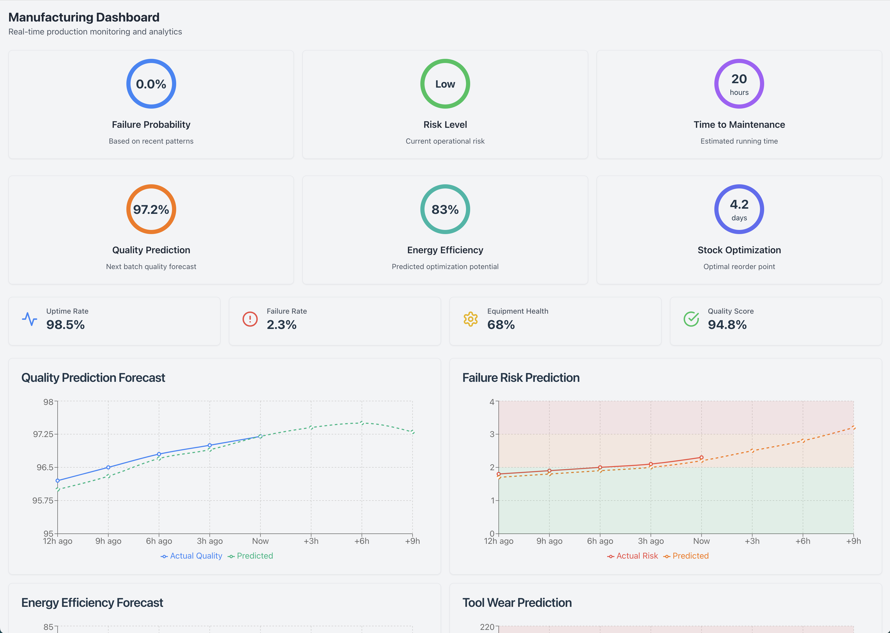
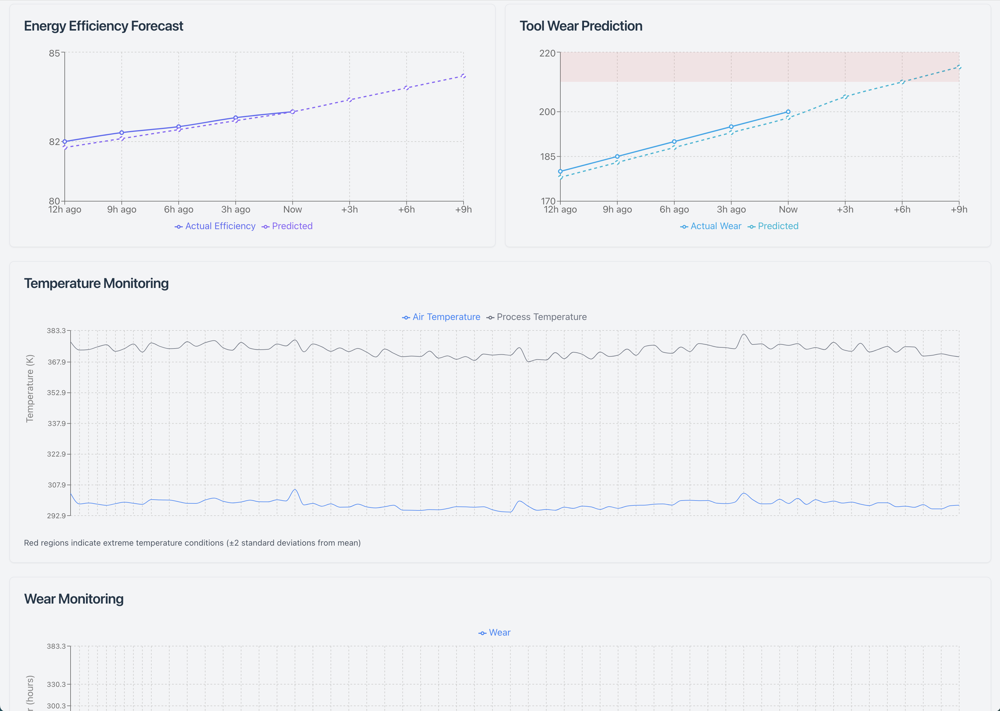
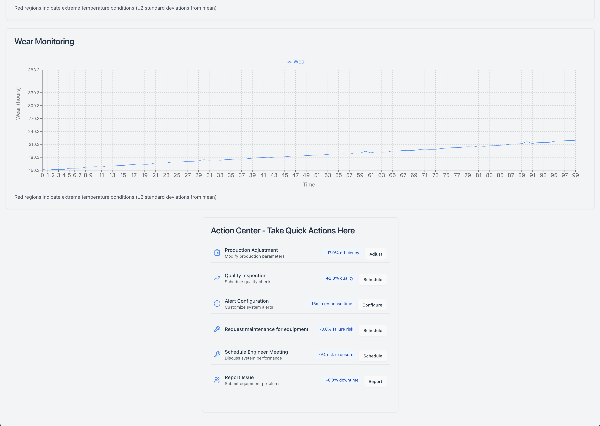

# Manufacturing Dashboard





A real-time production monitoring dashboard built with React, featuring predictive analytics, interactive visualizations, and actionable insights.

## Features

- **Real-time Monitoring**
  - Temperature tracking
  - Tool wear analysis
  - Process efficiency metrics

- **Predictive Analytics**
  - Failure probability forecasting
  - Quality prediction
  - Energy efficiency optimization
  - Maintenance scheduling

- **Interactive Action Center**
  - Priority-based recommendations
  - Impact-driven decision making
  - Automated alerting system
  - Maintenance scheduling

## Tech Stack

- React 18
- Tailwind CSS
- Recharts
- shadcn/ui
- Lucide Icons

## Getting Started

```bash
# Clone repository
git clone https://github.com/AshGod16/predictive-maintenance.git

# Install dependencies
cd dashboard
npm install

# Start development server
npm run dev

# Build for production
npm run build
```

## Project Structure

```
src/
├── components/
│   ├── ui/            # shadcn/ui components
│   └── Manufacturing/ # Dashboard components
├── lib/
│   └── utils.ts       # Utility functions
└── App.tsx           # Main application
```

## Usage

The dashboard automatically updates every minute with new simulated data. Action cards are sorted by potential impact and provide immediate access to relevant forms and controls.

## Contributing

1. Fork the repository
2. Create your feature branch
3. Commit your changes
4. Push to the branch
5. Create a pull request

## License

MIT License - see LICENSE file for details

## Contact

Your Name - akash.godbole16@gmail.com
Project Link: https://github.com/AshGod16/predictive-maintenance