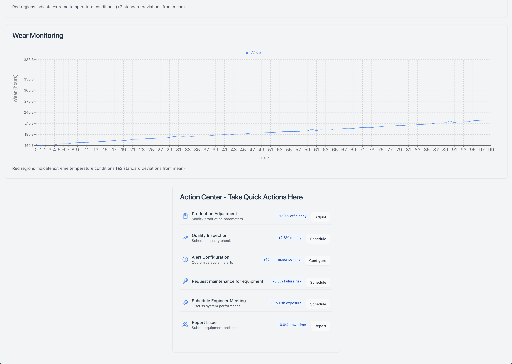

# 🔧 Industrial Equipment Predictive Maintenance System




> ML system that predicts equipment failures before they occur, maximizing manufacturing uptime through real-time monitoring and predictive analytics.

## ✨ Features

🎯 **High Accuracy**
- 96.6% equipment uptime
- 144-minute average warning time
- 3.4% failure rate across 10k+ records

📊 **Comprehensive Monitoring**
- Air & process temperature
- Rotational speed & torque
- Tool wear tracking
- Multiple product types

🤖 **Smart Predictions**
- Real-time parameter monitoring 
- Early failure detection
- Automated alerts
- Maintenance scheduling

## 🛠️ Technical Setup

### Prerequisites
```bash
Python 3.8+
scikit-learn
pandas
numpy
```

### Quick Start
```bash
# Clone repository
git clone https://github.com/yourusername/predictive-maintenance

# Install dependencies
cd predictive-maintenance
pip install -r requirements.txt
```

### Usage Example
```python
from maintenance_predictor import PredictiveModel

# Initialize and run predictions
model = PredictiveModel()
predictions = model.predict(sensor_data)
```

## 📈 Performance Metrics

| Metric | Value |
|--------|--------|
| Uptime Rate | 96.6% |
| Warning Time | 144 min |
| Product Types | 3 |
| Dataset Size | 10,000 |

## 🤝 Contributing

We welcome contributions! Please follow these steps:
1. Fork the repository
2. Create a feature branch
3. Submit a pull request

## 📝 License

Released under MIT License. See [LICENSE](LICENSE) for details.